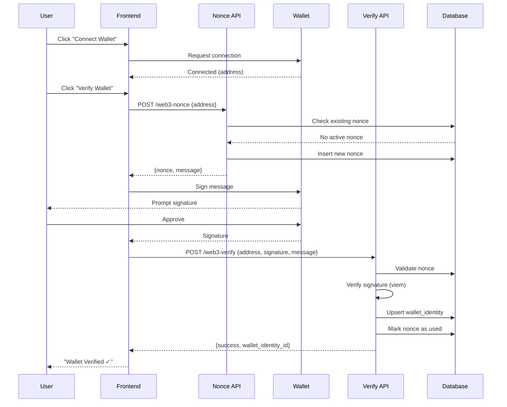

# Web3 Verification Module - RUNBOOK

**Version:** Phase 1.1 (CI/CD Enhanced)
**Date:** 2026-01-10
**Author:** OmniLink APEX Team
**Status:** ✅ Ready for Production

---

## 📋 Overview

The Web3 Verification Module is a read-only connector that enables wallet authentication and NFT-based entitlement gating for OmniLink APEX. Phase 1 focuses on signature verification, wallet identity mapping, and on-chain entitlement checks without requiring smart contract deployment.

### Key Capabilities

- 🔐 **Wallet Authentication**: Sign-in with Ethereum (SIWE) via message signing
- 🎫 **NFT Entitlements**: Check NFT ownership for access control
- 💾 **Smart Caching**: 10-minute cache for expensive RPC calls
- 🛡️ **Fortress Protocol**: Fail-closed security with circuit breakers
- 📊 **Full Observability**: Audit logging, analytics, and error tracking
- ⚡ **Async-First**: Non-blocking chain reads, never in render path

---

## 🏗️ Architecture

### Components

```
┌─────────────────────────────────────────────────────────────┐
│                     Frontend (React + wagmi)                 │
│  ┌──────────────┐  ┌──────────────┐  ┌──────────────┐      │
│  │ WalletConnect│  │ useWallet    │  │ Entitlements │      │
│  │  Component   │  │ Verification │  │   Checks     │      │
│  └──────┬───────┘  └──────┬───────┘  └──────┬───────┘      │
└─────────┼──────────────────┼──────────────────┼─────────────┘
          │                  │                  │
          ▼                  ▼                  ▼
┌─────────────────────────────────────────────────────────────┐
│              Supabase Edge Functions (Deno)                  │
│  ┌──────────────┐  ┌──────────────┐  ┌──────────────┐      │
│  │ web3-nonce   │  │ web3-verify  │  │ Entitlement  │      │
│  │ (Public)     │  │ (Auth Req'd) │  │   Checks     │      │
│  └──────┬───────┘  └──────┬───────┘  └──────┬───────┘      │
└─────────┼──────────────────┼──────────────────┼─────────────┘
          │                  │                  │
          ▼                  ▼                  ▼
┌─────────────────────────────────────────────────────────────┐
│                  Supabase PostgreSQL                         │
│  ┌──────────────────┐  ┌───────────────────┐               │
│  │ wallet_identities│  │ wallet_nonces     │               │
│  │ entitlements     │  │ chain_cache       │               │
│  └──────────────────┘  └───────────────────┘               │
└─────────────────────────────────────────────────────────────┘
          │                  │
          ▼                  ▼
┌─────────────────────────────────────────────────────────────┐
│              Blockchain RPC Endpoints (viem)                 │
│  Ethereum • Polygon • Optimism • Arbitrum                    │
└─────────────────────────────────────────────────────────────┘
```

### Data Flow: Wallet Verification



---

## 🚀 Deployment Guide

### Prerequisites

1. **Supabase Project**: Active Supabase project with Edge Functions enabled
2. **RPC Endpoints**: Ethereum node RPC URLs (Alchemy, Infura, or self-hosted)
3. **Environment Variables**: Configured in Supabase and Vercel/local

### Step 1: Database Migration

Run the migration to create required tables:

```bash
# Using Supabase CLI
supabase db push

# Or manually via Supabase Dashboard
# 1. Go to SQL Editor
# 2. Paste contents of supabase/migrations/20260101000000_create_web3_verification.sql
# 3. Run migration
```

**Verify migration:**
```sql
SELECT table_name FROM information_schema.tables
WHERE table_schema = 'public'
AND table_name IN ('wallet_identities', 'wallet_nonces', 'entitlements', 'chain_entitlements_cache');
```

Expected: 4 tables

### Step 2: Environment Variables

**Supabase Secrets** (for Edge Functions):
```bash
supabase secrets set SUPABASE_URL=https://your-project.supabase.co
supabase secrets set SUPABASE_SERVICE_ROLE_KEY=your-service-role-key
```

**Frontend Environment** (.env.local):
```env
# Required
VITE_SUPABASE_URL=https://your-project.supabase.co
VITE_SUPABASE_ANON_KEY=your-anon-key

# RPC Endpoints (at least one required)
VITE_ETHEREUM_RPC_URL=https://eth-mainnet.g.alchemy.com/v2/YOUR_KEY
VITE_POLYGON_RPC_URL=https://polygon-mainnet.g.alchemy.com/v2/YOUR_KEY
VITE_OPTIMISM_RPC_URL=https://opt-mainnet.g.alchemy.com/v2/YOUR_KEY
VITE_ARBITRUM_RPC_URL=https://arb-mainnet.g.alchemy.com/v2/YOUR_KEY

# Optional: WalletConnect (recommended for mobile wallets)
VITE_WALLETCONNECT_PROJECT_ID=your-walletconnect-project-id
```

**Get WalletConnect Project ID:**
1. Visit https://cloud.walletconnect.com/
2. Create new project
3. Copy Project ID

### Step 3: Deploy Edge Functions

**CI/CD Pipeline (Recommended):**
The repository uses `.github/workflows/deploy-web3-functions.yml` for automated deployment.
The pipeline follows a strict sequence:
1. **Link**: Connect to Supabase project
2. **Migrate**: Apply schema changes (`supabase db push`)
3. **Deploy**: Update Edge Functions
4. **Verify**: Run smoke tests with retry logic (3 attempts)

**Manual Deployment:**
```bash
# Deploy web3-nonce function
supabase functions deploy web3-nonce

# Deploy web3-verify function
supabase functions deploy web3-verify

# Verify deployment
supabase functions list
```

**Test edge functions:**
```bash
# Test nonce generation
curl -X POST \
  https://your-project.supabase.co/functions/v1/web3-nonce \
  -H "Content-Type: application/json" \
  -d '{"wallet_address":"0x742d35Cc6634C0532925a3b844Bc9e7595f0bEb"}'

# Expected response:
# {
#   "nonce": "...",
#   "expires_at": "...",
#   "message": "...",
#   "wallet_address": "0x742d35cc6634c0532925a3b844bc9e7595f0beb",
#   "reused": false
# }
```

### Step 4: Install Frontend Dependencies

```bash
npm install wagmi viem @tanstack/react-query
```

### Step 5: Integrate into Application

**Add Web3Provider to app root:**

```tsx
// src/App.tsx
import { Web3Provider } from '@/providers/Web3Provider';
import { AuthProvider } from '@/contexts/AuthContext';

function App() {
  return (
    <AuthProvider>
      <Web3Provider>
        {/* Your app components */}
      </Web3Provider>
    </AuthProvider>
  );
}
```

**Add WalletConnect component:**

```tsx
// src/pages/Profile.tsx
import { WalletConnect } from '@/components/WalletConnect';

export function Profile() {
  return (
    <div>
      <h1>Profile</h1>
      <WalletConnect />
    </div>
  );
}
```

---

## 🎯 Usage Examples

### Basic Wallet Verification

```tsx
import { useWalletVerification } from '@/hooks/useWalletVerification';

function MyComponent() {
  const { walletState, verify, disconnect } = useWalletVerification();

  if (!walletState.isVerified) {
    return (
      <button onClick={verify} disabled={walletState.status === 'verifying'}>
        {walletState.status === 'verifying' ? 'Verifying...' : 'Verify Wallet'}
      </button>
    );
  }

  return (
    <div>
      <p>Verified: {walletState.address}</p>
      <button onClick={disconnect}>Disconnect</button>
    </div>
  );
}
```

### NFT-Gated Content

```tsx
import { checkEntitlement } from '@/lib/web3/entitlements';
import { useWalletVerification } from '@/hooks/useWalletVerification';
import { useState, useEffect } from 'react';

function PremiumContent() {
  const { walletState } = useWalletVerification();
  const [hasAccess, setHasAccess] = useState(false);
  const [loading, setLoading] = useState(true);

  useEffect(() => {
    async function checkAccess() {
      if (!walletState.isVerified || !walletState.address) {
        setHasAccess(false);
        setLoading(false);
        return;
      }

      const result = await checkEntitlement({
        walletAddress: walletState.address,
        chainId: 1, // Ethereum mainnet
        contractAddress: '0xYourNFTContract...',
        entitlementKey: 'nft:premium-access',
      });

      setHasAccess(result.hasEntitlement);
      setLoading(false);
    }

    checkAccess();
  }, [walletState.address, walletState.isVerified]);

  if (loading) return <div>Checking access...</div>;
  if (!hasAccess) return <div>Access denied. NFT required.</div>;

  return <div>🎉 Premium content here!</div>;
}
```

### Manual Entitlement Grant (Admin)

```tsx
import { grantEntitlement } from '@/lib/web3/entitlements';

async function grantPremiumAccess(walletAddress: string) {
  const result = await grantEntitlement(
    'wallet',
    walletAddress,
    'role:premium',
    new Date('2026-12-31'), // Optional expiry
    { granted_by: 'admin', reason: 'early supporter' }
  );

  if (result.success) {
    console.log('✓ Entitlement granted');
  } else {
    console.error('✗ Failed:', result.error);
  }
}
```

### Protected API Endpoint

```tsx
import { withWalletGuard } from '@/lib/web3/guardrails';

async function premiumApiAction() {
  return withWalletGuard(async (userId, walletAddress) => {
    // This code only runs if user has verified wallet
    console.log(`User ${userId} with wallet ${walletAddress} accessed premium API`);

    // Your protected logic here
    return { success: true, data: '...' };
  });
}
```

---

## 🔧 Configuration

### Supported Chains

| Chain | Chain ID | Default RPC | Status |
|-------|----------|-------------|--------|
| Ethereum | 1 | `mainnet.rpcUrls.default` | ✅ Supported |
| Polygon | 137 | `polygon.rpcUrls.default` | ✅ Supported |
| Optimism | 10 | `optimism.rpcUrls.default` | ✅ Supported |
| Arbitrum | 42161 | `arbitrum.rpcUrls.default` | ✅ Supported |

**Adding new chains:**

1. Update `/src/lib/web3/config.ts`:
   ```ts
   import { base } from 'wagmi/chains';

   export const supportedChains = [..., base];
   ```

2. Add RPC URL to environment:
   ```env
   VITE_BASE_RPC_URL=https://mainnet.base.org
   ```

3. Update `entitlements.ts` chain config map

### Rate Limits

| Endpoint | Limit | Window | Notes |
|----------|-------|--------|-------|
| `/web3-nonce` | 5 requests | 1 minute (per IP) | |
| `/web3-verify` | 10 attempts | 1 hour (per user) | |
| `/supabase_healthcheck` | 10 requests | 1 minute (per user/IP) | Unauthenticated requests grouped as 'anonymous' |

**Customize rate limits** in edge function files:
```ts
// supabase/functions/web3-nonce/index.ts
const RATE_LIMIT_MAX = 10; // Increase to 10
const RATE_LIMIT_WINDOW_MS = 120000; // 2 minutes
```

### Cache TTL

Default: **10 minutes**

**Customize cache duration:**
```ts
// src/lib/web3/entitlements.ts
const CACHE_TTL_MS = 5 * 60 * 1000; // 5 minutes
```

### Circuit Breaker

**Configuration:**
- Threshold: 5 consecutive failures
- Reset timeout: 60 seconds
- Applies per chain (chain:1, chain:137, etc.)

**Behavior:**
- After 5 RPC failures, circuit opens
- All requests fail closed (deny access) unless allowlist grants entitlement
- After 60s, circuit resets and tries again

---

## 🧪 Testing

### Run Unit Tests

```bash
npm run test tests/web3/signature-verification.test.ts
```

Expected output:
```
✓ Web3 Signature Verification (8 tests)
  ✓ Valid Signature (2)
  ✓ Invalid Signature (3)
  ✓ Error Handling (2)
  ✓ Message Format Validation (2)
```

### Run Integration Tests

```bash
npm run test tests/web3/wallet-integration.test.ts
```

Expected output:
```
✓ Wallet Integration Flow (5 tests)
  ✓ Wallet Connection (2)
  ✓ Wallet Verification (2)
  ✓ Verified State Persistence (1)
  ✓ Disconnect Flow (1)
```

### Manual End-to-End Test

1. **Start development server:**
   ```bash
   npm run dev
   ```

2. **Navigate to wallet connect page**

3. **Connect wallet:**
   - Click "Connect MetaMask" (or your wallet)
   - Approve connection in wallet

4. **Verify wallet:**
   - Click "Verify Wallet"
   - Sign message in wallet
   - Confirm "Wallet Verified ✓" appears

5. **Test entitlement check:**
   ```tsx
   // In browser console
   import { checkEntitlement } from '@/lib/web3/entitlements';

   const result = await checkEntitlement({
     walletAddress: '0xYourAddress',
     chainId: 1,
     contractAddress: '0xBoredApeYachtClub...',
     entitlementKey: 'nft:bayc',
   });

   console.log(result);
   // { hasEntitlement: true/false, source: 'chain'/'cache'/'allowlist', ... }
   ```

---

## 🚨 Troubleshooting

### Issue: "Nonce not found or already used"

**Cause:** Nonce expired or was used in previous attempt

**Solution:**
1. Request new nonce (automatic on retry)
2. Check nonce hasn't expired (5-minute TTL)
3. Clear expired nonces: `SELECT cleanup_expired_nonces();`

### Issue: "RPC error" or timeouts

**Cause:** RPC endpoint is down or rate-limited

**Solution:**
1. Check RPC URL is correct in env vars
2. Verify RPC endpoint is accessible (curl test)
3. Check rate limits on RPC provider dashboard
4. Circuit breaker may be open (wait 60s)

**Fallback:** Use allowlist to grant entitlement manually

### Issue: "Circuit breaker open"

**Cause:** 5+ consecutive RPC failures

**Solution:**
1. Wait 60 seconds for automatic reset
2. Fix underlying RPC issue
3. Grant temporary allowlist entitlements:
   ```sql
   INSERT INTO entitlements (subject_type, subject_id, entitlement_key, source)
   VALUES ('wallet', '0xaddress...', 'nft:xyz', 'allowlist');
   ```

### Issue: Wallet verification succeeds but entitlement fails

**Cause:** Wallet doesn't own required NFT OR RPC call failed

**Solution:**
1. Verify NFT ownership on block explorer
2. Check contract address is correct
3. Check cache table for stale data:
   ```sql
   DELETE FROM chain_entitlements_cache
   WHERE wallet_address = '0xaddress...'
   AND chain_id = 1;
   ```

### Issue: "No active session" error

**Cause:** User not authenticated with Supabase

**Solution:**
1. Verify user is signed in
2. Check AuthProvider wraps Web3Provider
3. Check session token is valid:
   ```ts
   const { data } = await supabase.auth.getSession();
   console.log(data.session);
   ```
4. **CI Smoke Tests**: If seeing this in CI, ensure `SUPABASE_ANON_KEY` or `SUPABASE_SERVICE_ROLE_KEY` is correctly injected in the workflow. The `supabase_healthcheck` function allows anonymous access for smoke tests but requires a valid JWT signature.

---

## 📊 Monitoring & Observability

### Audit Logs

All wallet operations are logged to `audit_logs` table:

```sql
-- Recent wallet verifications
SELECT * FROM audit_logs
WHERE action IN ('wallet_verified', 'wallet_verify_failed')
ORDER BY timestamp DESC
LIMIT 100;

-- Rate limited attempts
SELECT * FROM audit_logs
WHERE action = 'wallet_verify_rate_limited'
ORDER BY timestamp DESC;
```

### Analytics Events

Tracked via `logAnalyticsEvent`:
- `wallet_verify_started`
- `wallet_verified`
- `wallet_auto_verified`
- `web3_entitlement_check`
- `entitlement_granted`

**Query analytics:**
```sql
SELECT
  metadata->>'action' as action,
  COUNT(*) as count
FROM audit_logs
WHERE resource_type = 'analytics'
AND timestamp > NOW() - INTERVAL '7 days'
GROUP BY action
ORDER BY count DESC;
```

### Database Metrics

**Wallet identities:**
```sql
SELECT
  COUNT(*) as total_wallets,
  COUNT(DISTINCT user_id) as unique_users,
  COUNT(DISTINCT chain_id) as chains_used
FROM wallet_identities;
```

**Cache hit rate:**
```sql
SELECT
  COUNT(*) as cached_checks,
  AVG(EXTRACT(EPOCH FROM (NOW() - refreshed_at))) as avg_age_seconds
FROM chain_entitlements_cache
WHERE refreshed_at > NOW() - INTERVAL '1 hour';
```

**Nonce statistics:**
```sql
SELECT
  COUNT(*) FILTER (WHERE used_at IS NULL AND expires_at > NOW()) as active_nonces,
  COUNT(*) FILTER (WHERE used_at IS NOT NULL) as used_nonces,
  COUNT(*) FILTER (WHERE expires_at < NOW() AND used_at IS NULL) as expired_nonces
FROM wallet_nonces;
```

---

## 🔒 Security Considerations

### Phase 1 Security Model

✅ **What's Secure:**
- No private keys stored server-side
- Signatures verified cryptographically
- Fail-closed on errors
- Rate limiting on all endpoints
- Audit logging for all operations
- RLS policies on all tables
- Nonce replay attack prevention

⚠️ **Limitations (By Design - Phase 1):**
- No on-chain writes (read-only)
- No token transfers or approvals
- No smart contract interactions
- Trust RPC provider for chain data

### Zero-Trust Checklist

- [x] Wallet signatures verified server-side
- [x] Nonces are single-use and time-limited
- [x] User authentication required for verification
- [x] All chain data cached with TTL
- [x] Circuit breakers prevent cascading failures
- [x] Rate limiting per user and IP
- [x] Audit logs for security events
- [x] RLS policies enforce data isolation

### Allowlist Considerations

**When to use allowlists:**
- ✅ Early access / beta testing
- ✅ Emergency access during RPC outages
- ✅ Promotional campaigns
- ✅ Admin overrides

**Best practices:**
- Set expiry dates for temporary access
- Include metadata (reason, granted_by)
- Audit allowlist changes
- Remove expired entries regularly

---

## 📈 Performance Optimization

### Cache Strategy

1. **First request:** Chain read (slow, ~500ms-2s)
2. **Cached requests:** Database read (fast, ~10-50ms)
3. **Cache TTL:** 10 minutes (configurable)

**Cache invalidation:**
```sql
-- Manual invalidation for wallet
DELETE FROM chain_entitlements_cache
WHERE wallet_address = '0xaddress...' AND chain_id = 1;

-- Clear all expired cache
DELETE FROM chain_entitlements_cache
WHERE refreshed_at < NOW() - INTERVAL '10 minutes';
```

### RPC Optimization

- Timeout: 5 seconds per call
- Retries: 3 attempts with exponential backoff
- Circuit breaker: Stop trying after 5 failures
- Batch queries: Not implemented in Phase 1 (future enhancement)

### Frontend Performance

- Wallet state persisted in React state
- Auto-verification on page load if already verified
- No blocking chain calls during initial render
- Lazy load WalletConnect component

---

## 🛣️ Roadmap (Future Phases)

### Phase 2: Advanced Entitlements
- [ ] Token balance checks (ERC-20)
- [ ] Multi-chain entitlement rules (AND/OR logic)
- [ ] Time-based entitlements (token-gated access windows)
- [ ] Delegation support (wallet A grants access to wallet B)

### Phase 3: On-Chain Interactions
- [ ] Signature-based gasless transactions
- [ ] Smart contract deployment for on-chain verification
- [ ] NFT minting for verified users
- [ ] On-chain credential issuance

### Phase 4: Advanced Features
- [ ] Biometric wallet recovery
- [ ] Multi-sig support for enterprise
- [ ] Cross-chain identity bridging
- [ ] zkProof-based privacy-preserving verification

---

## 📞 Support

**Issues:** https://github.com/apexbusiness-systems/OmniLink-APEX/issues
**Documentation:** `/docs/WEB3_VERIFICATION_RUNBOOK.md`
**Migration Files:** `/supabase/migrations/20260101000000_create_web3_verification.sql`

**Emergency Contacts:**
- Database issues: Check Supabase dashboard
- RPC issues: Check provider dashboard (Alchemy/Infura)
- Frontend issues: Check browser console + network tab

---

## ✅ Pre-Launch Checklist

Before deploying to production:

- [ ] Database migration applied successfully
- [ ] All 4 tables created with RLS policies
- [ ] Edge functions deployed and tested
- [ ] Environment variables configured
- [ ] RPC endpoints tested and responding
- [ ] Rate limits configured appropriately
- [ ] Unit tests passing (8/8)
- [ ] Integration tests passing (5/5)
- [ ] Manual E2E test completed successfully
- [ ] Monitoring dashboards configured
- [ ] Audit logging verified working
- [ ] Security review completed
- [ ] Load testing performed (if high traffic expected)
- [ ] Rollback plan documented
- [ ] Team trained on troubleshooting procedures

---

**Last Updated:** 2026-01-10
**Next Review:** After 1 week of production usage

**Maintainer:** OmniLink APEX Team
**License:** Proprietary - OmniLink APEX
