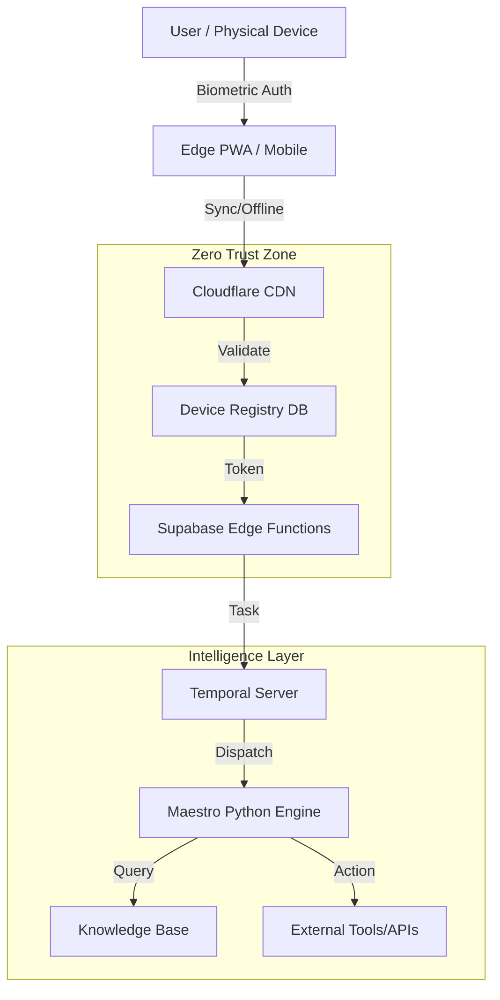

# APEX-OmniHub Technical Architecture Specification

**Document Owner:** CTO & Chief Platform Architect  
**Last Updated:** 2026-02-01  
**Status:** Production  
**Version:** 2.1 (Cyber-Physical Update)

---

## Executive Summary

APEX-OmniHub is a production-grade, **Hybrid-Cloud AI Operating System**. It converges Web3 (Token-gating), Generative AI (Maestro), and **Physical Hardware Identity** into a unified control plane. This document reflects the "Unicorn-Class" architecture verified in the Feb 2026 audit.

**Core Value Proposition:**

- **Multi-skill AI orchestration** via Temporal.io workflows
- **Cyber-Physical Security** with Zero-Trust Device Registry & Biometrics
- **Edge-First Architecture** running locally on iOS/Android via Capacitor
- **Enterprise Resilience** with Chaos Engineering & Self-Healing (OmniSentry)

---

## 1. Technology Stack (Actual Implementation)

### 1.1 Frontend Stack (The Hub)

| Layer              | Technology     | Version | Purpose                   |
| ------------------ | -------------- | ------- | ------------------------- |
| **Framework**      | React          | 18.3.1  | Component-based UI        |
| **Mobile Runtime** | Capacitor      | 6.0+    | Native iOS/Android Bridge |
| **State**          | TanStack Query | 5.83    | Offline-first sync engine |
| **UI**             | Shadcn UI      | Latest  | Accessible Design System  |
| **Web3**           | Wagmi + Viem   | 2.x     | Blockchain Identity       |

### 1.2 Physical AI Stack (The Senses)

| Component           | Implementation                     | Purpose                      |
| ------------------- | ---------------------------------- | ---------------------------- |
| **Device Registry** | `src/zero-trust/deviceRegistry.ts` | Hardware-level Allowlisting  |
| **Ears (Audio)**    | `src/utils/RealtimeAudio.ts`       | Real-time Voice Intelligence |
| **Identity**        | `src/lib/biometric-native.ts`      | Hardware Enclave Signing     |
| **Eyes (Vision)**   | `src/integrations/omniport`        | Multimodal Input Analysis    |

### 1.3 Backend Stack (The Brain)

| Layer            | Technology        | Purpose                          |
| ---------------- | ----------------- | -------------------------------- |
| **Orchestrator** | Python (FastAPI)  | Heavy AI Logic & Agents          |
| **Engine**       | Temporal.io       | Durable Execution & Retries      |
| **Database**     | Supabase (PG)     | Relational Data & Edge Functions |
| **Vector DB**    | Supabase pgvector | Semantic Memory (RAG)            |

---

## 2. System Architecture Diagram



---

## 3. Directory Structure (Key Components)

```plaintext
/
├── apps/omnihub-site/        # The Control Surface (PWA)
│   ├── src/zero-trust/       # Device Registry Logic
│   ├── src/lib/biometric/    # Hardware Security Module
│   └── capacitor.config.ts   # Native Bridge Config
│
├── orchestrator/             # The AI Brain (Python)
│   ├── activities/           # Agent Capabilities
│   └── workflows/            # Durable Logic
│
├── supabase/                 # The Data Layer
│   ├── migrations/           # SQL Schema (inc. device_registry)
│   └── functions/            # Edge Logic (Voice, Auth)
```

---

## Appendix A: Port & Service Reference

| Service        | Port/URL            | Purpose                |
| -------------- | ------------------- | ---------------------- |
| Frontend Dev   | localhost:5173      | Vite dev server        |
| Orchestrator   | localhost:8000      | FastAPI backend        |
| Temporal UI    | localhost:8080      | Workflow visualization |
| Realtime Audio | wss://api.openai... | Voice Stream (Proxied) |
| Local DB       | localhost:54322     | Supabase PostgreSQL    |

---

**Document Version:** 2.1  
**Last Audit:** 2026-02-01
