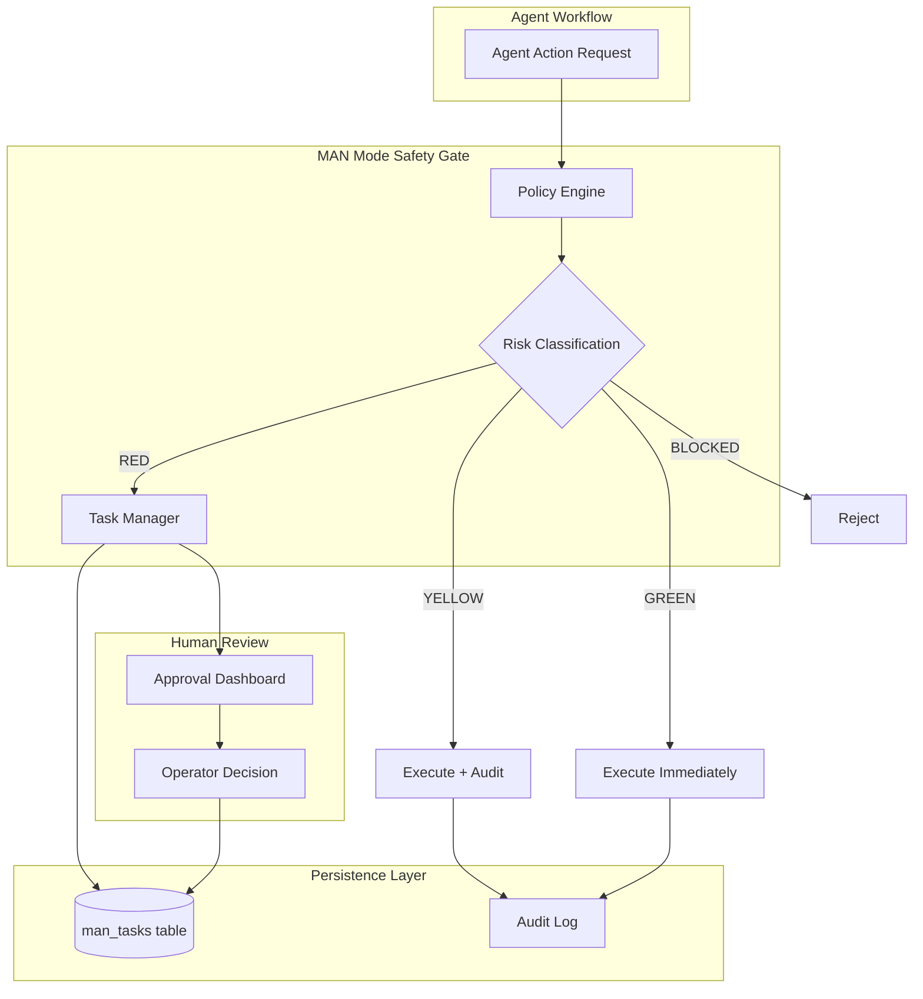
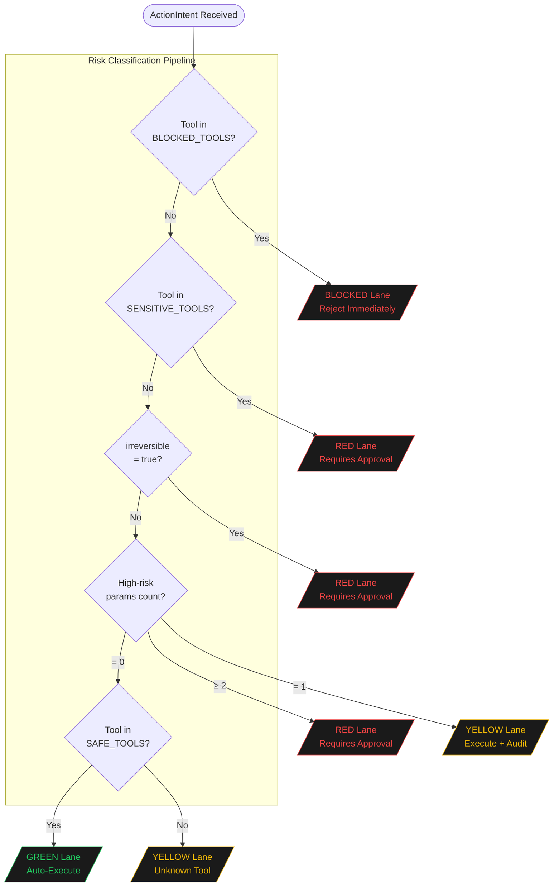
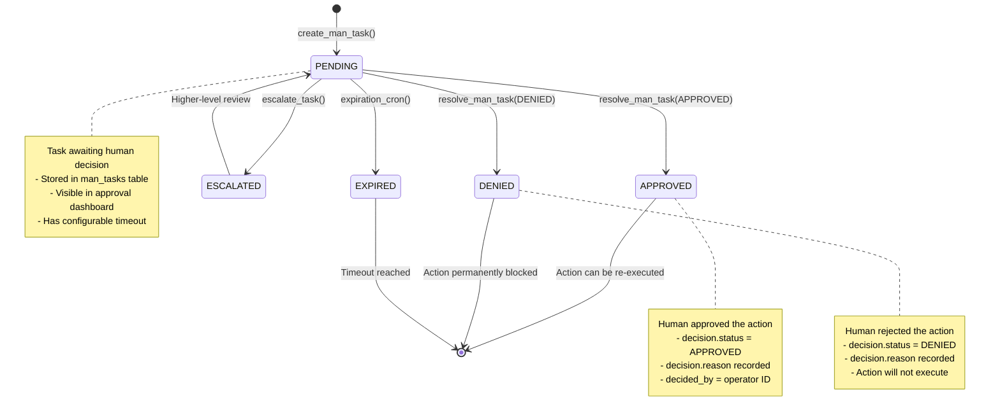
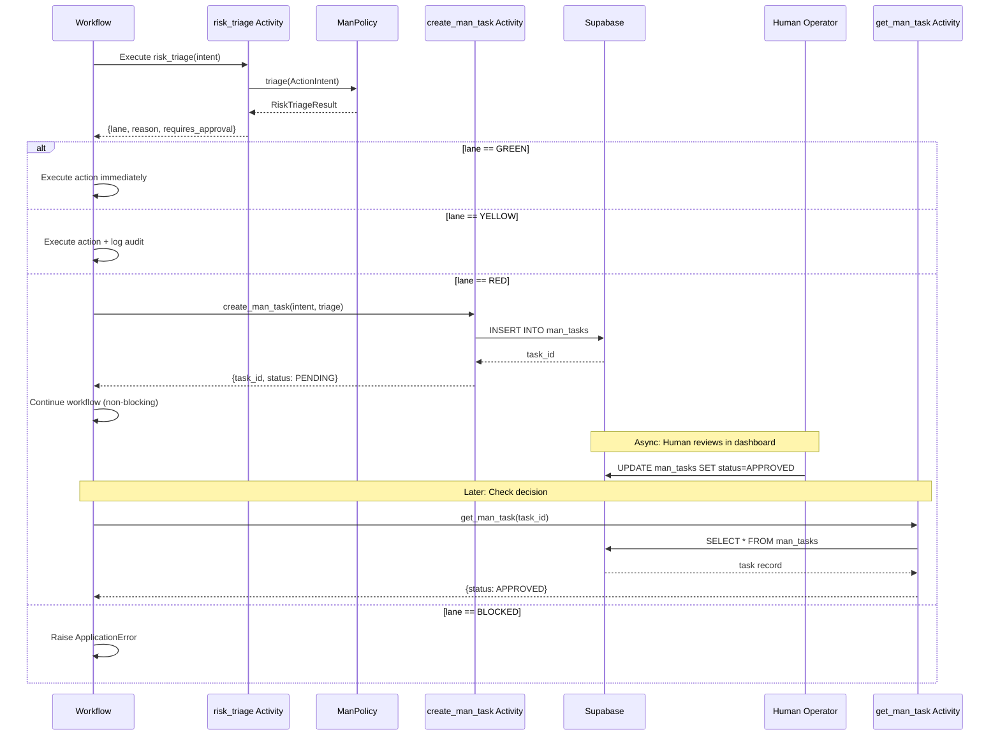
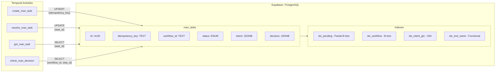
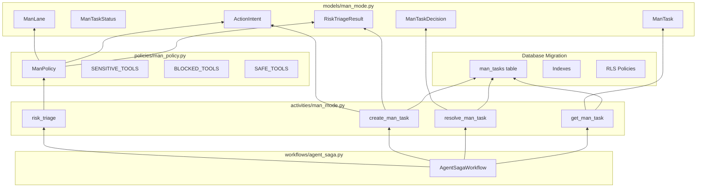
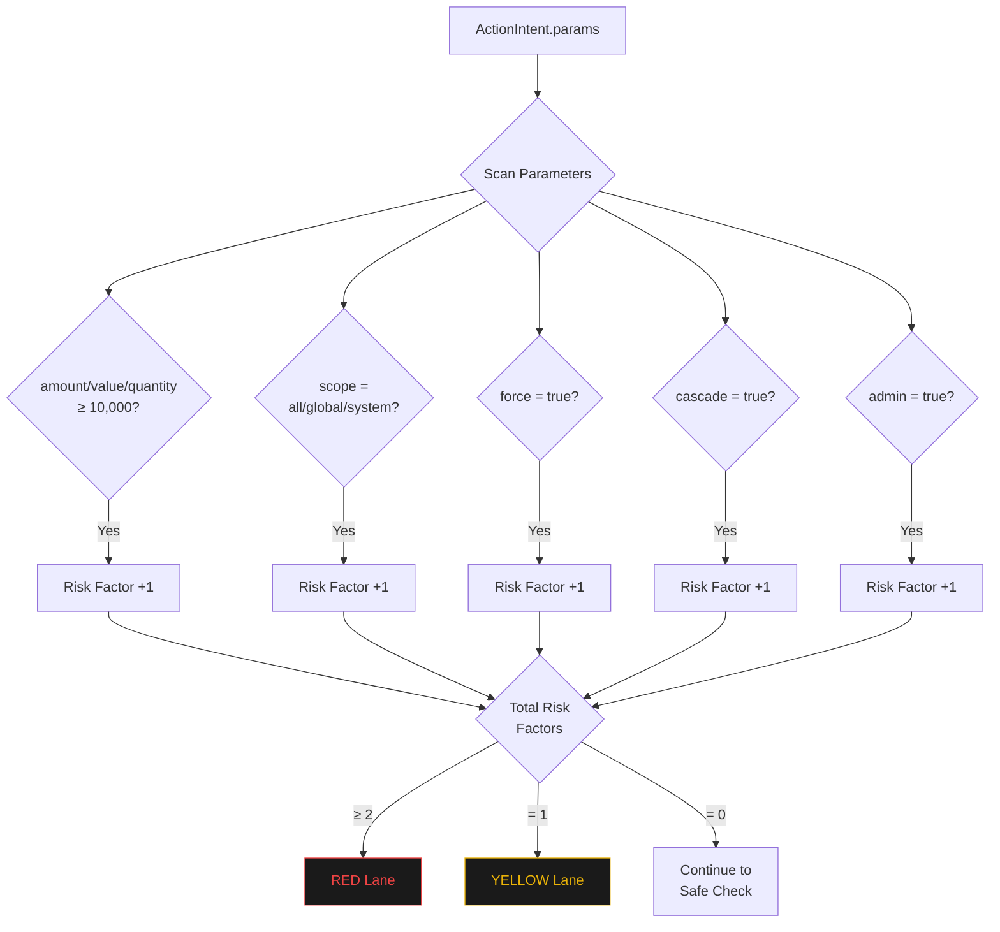
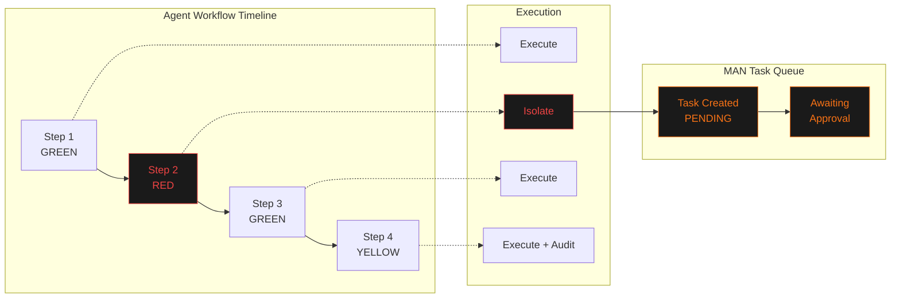

# MAN Mode Workflow Diagrams

> Manual Assistance Needed (MAN) Mode - Visual Architecture Reference

## Table of Contents

1. [System Architecture Overview](#system-architecture-overview)
2. [Risk Classification Flow](#risk-classification-flow)
3. [Approval Task State Machine](#approval-task-state-machine)
4. [Temporal Workflow Integration](#temporal-workflow-integration)
5. [Database Interaction Flow](#database-interaction-flow)
6. [Component Dependencies](#component-dependencies)

---

## System Architecture Overview

---

## Risk Classification Flow

---

## Approval Task State Machine

---

## Temporal Workflow Integration

---

## Database Interaction Flow

---

## Component Dependencies

---

## High-Risk Parameter Detection

---

## Non-Blocking Isolation Pattern

**Key Insight**: RED lane actions do not block the workflow. The action is recorded for human review while subsequent steps continue executing. This prioritizes workflow throughput over synchronous approval.

---

## Tool Classification Quick Reference

| Category | Tools | Lane |
|----------|-------|------|
| **Financial** | transfer_funds, process_payment, refund_payment | RED |
| **Destructive** | delete_record, delete_user, purge_data, drop_table | RED |
| **Account Mgmt** | deactivate_account, suspend_user, revoke_access | RED |
| **System** | modify_config, update_secrets, deploy_code | RED |
| **Communication** | send_email, send_sms, broadcast_message | RED |
| **Prohibited** | execute_sql_raw, shell_execute, admin_override | BLOCKED |
| **Read-Only** | search_database, read_record, get_config | GREEN |
| **Unknown** | Any tool not in above lists | YELLOW |

---

## Version History

| Version | Date | Changes |
|---------|------|---------|
| 1.0.0 | 2026-01-08 | Initial MAN Mode implementation |
| 1.0.1 | 2026-01-09 | Performance optimizations, GIN indexes, diagram documentation |

---

*Document generated for APEX OmniHub Orchestrator. Diagrams render in GitHub-flavored Markdown with Mermaid support.*
