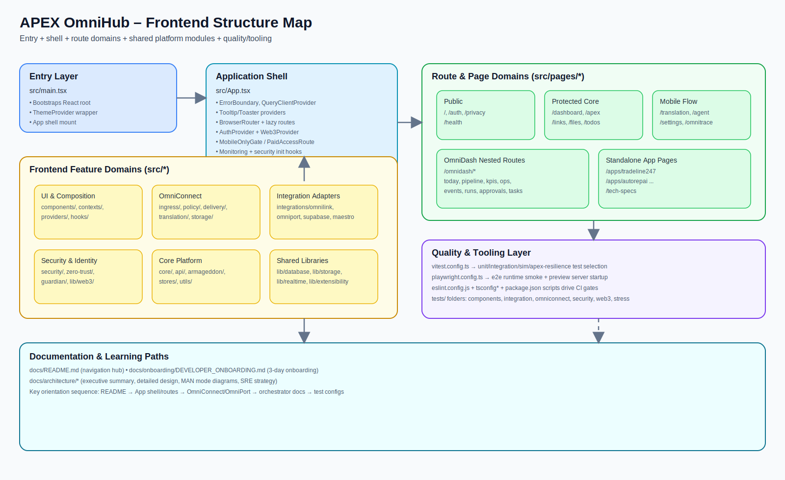

<!-- APEX_DOC_STAMP: VERSION=v8.0-LAUNCH | LAST_UPDATED=2026-02-20 -->
# Frontend Structure Map

This document maps the main frontend topology in `APEX-OmniHub`, with a visual artifact for quick onboarding and architecture reviews.

## Scope

The map focuses on the React/Vite application rooted under `src/`, its route shell, feature domains, shared libraries, and quality/testing entry points.

## High-Level Topology

1. **Bootstrap & Shell**
   - `src/main.tsx` mounts the app and theme provider.
   - `src/App.tsx` composes core providers (error boundary, React Query, router, auth, web3) and route definitions.

2. **Route Surfaces**
   - Public pages (`/`, `/auth`, `/privacy`, `/health`)
   - Protected/mobile-gated pages (`/dashboard`, `/translation`, `/agent`, `/settings`, etc.)
   - Nested OmniDash route tree (`/omnidash/*`)
   - Standalone app pages (`/apps/*`, `/tech-specs`)

3. **Feature Domains under `src/`**
   - UI composition (`components`, `contexts`, `providers`, `hooks`)
   - OmniConnect pipeline (`omniconnect/*`)
   - Integrations (`integrations/*`)
   - Security & identity (`security`, `zero-trust`, `guardian`, `lib/web3`)
   - Core/support modules (`core`, `api`, `stores`, `utils`, `armageddon`, `lib/*`)

4. **Testing & Tooling Layer**
   - Vitest (`vitest.config.ts`) for broad frontend/unit/integration/simulation suites.
   - Playwright (`playwright.config.ts`) for runtime smoke/e2e.
   - Type/lint/build/security scripts in `package.json` + config files.

## Visual Diagram Artifact

## Maintenance Notes

- Update this map when `src/App.tsx` route groups change materially.
- Update domain boxes if new top-level frontend subsystems are added under `src/`.
- Keep this file aligned with onboarding docs and architecture summaries.
