# Chaos Simulation Architecture
## APEX OmniHub Integrated System Testing

**Version:** 1.0
**Date:** 2026-01-03

---

## 🎯 System Overview

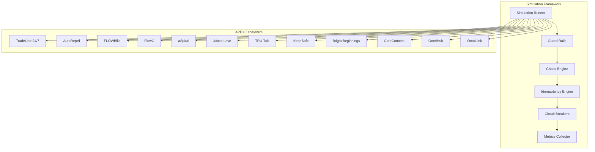

---

## 🔄 Event Flow Architecture

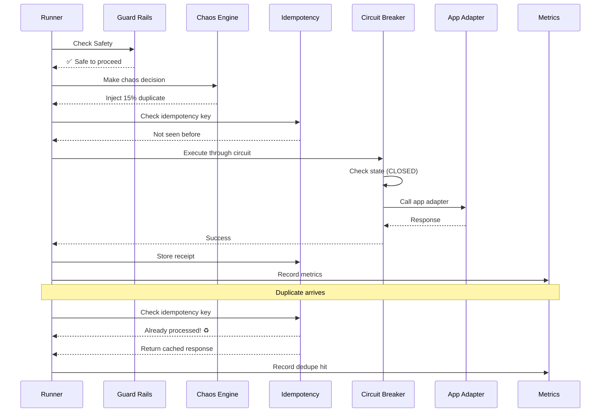

---

## 🛡️ Guard Rails Architecture

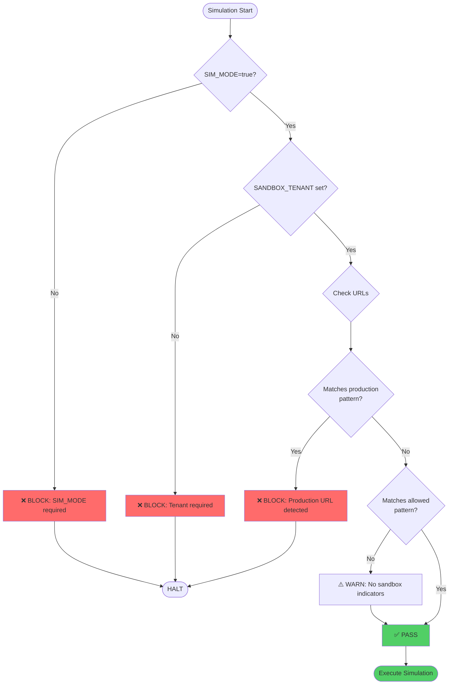

---

## 🎲 Chaos Injection Flow

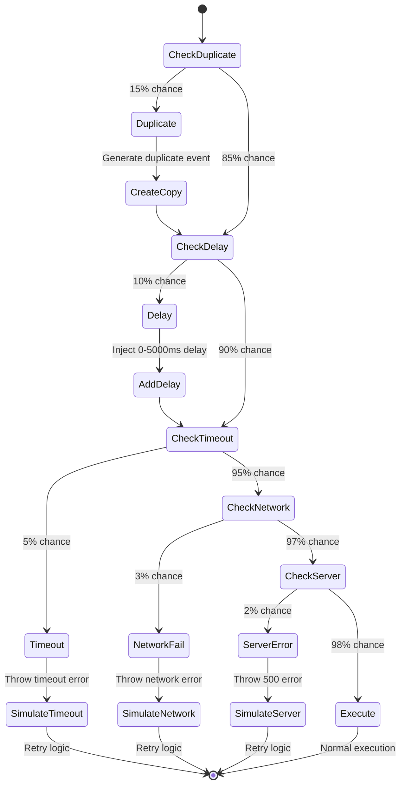

---

## 🔁 Circuit Breaker State Machine

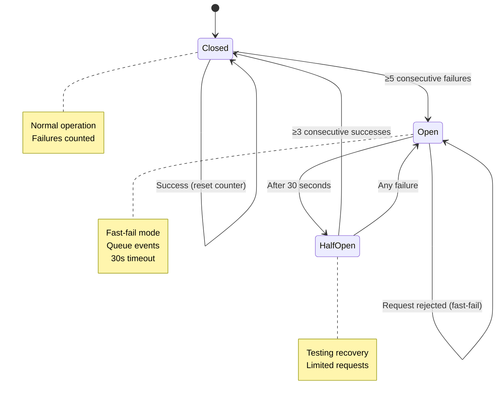

---

## 💾 Idempotency Architecture

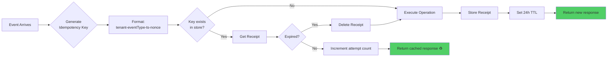

---

## 📊 Metrics Collection Flow

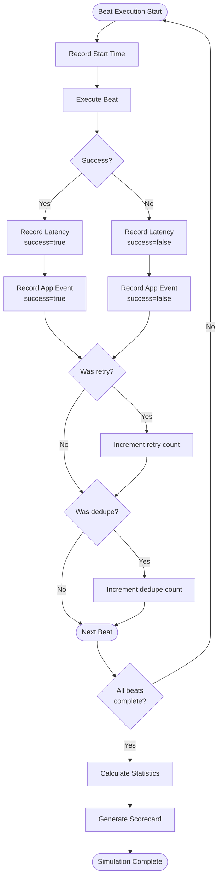

---

## 🏗️ Component Architecture

### Core Components

| Component | Responsibility | Dependencies | State |
|-----------|---------------|--------------|-------|
| **Guard Rails** | Production protection | Environment variables | Stateless |
| **Chaos Engine** | Deterministic chaos injection | Seeded RNG | Stateful (sequence) |
| **Idempotency Engine** | Deduplication | In-memory store | Stateful (receipts) |
| **Circuit Breaker** | Failure isolation | Timers | Stateful (state machine) |
| **Metrics Collector** | Performance tracking | In-memory arrays | Stateful (metrics) |
| **Simulation Runner** | Orchestration | All above | Stateful (run state) |

### Data Flow

```mermaid
graph LR
    Config[Configuration] --> Runner
    Runner --> Event[Event Envelope]
    Event --> Chaos[Chaos Decision]
    Chaos --> EventWithChaos[Event + Chaos Metadata]
    EventWithChaos --> Idempotency[Idempotency Check]
    Idempotency --> Circuit[Circuit Breaker]
    Circuit --> Adapter[App Adapter]
    Adapter --> Response[Response]
    Response --> Receipt[Idempotency Receipt]
    Receipt --> Metric[Latency Metric]
    Metric --> Scorecard[Final Scorecard]
```

---

## 🔐 Security Architecture

### Isolation Layers

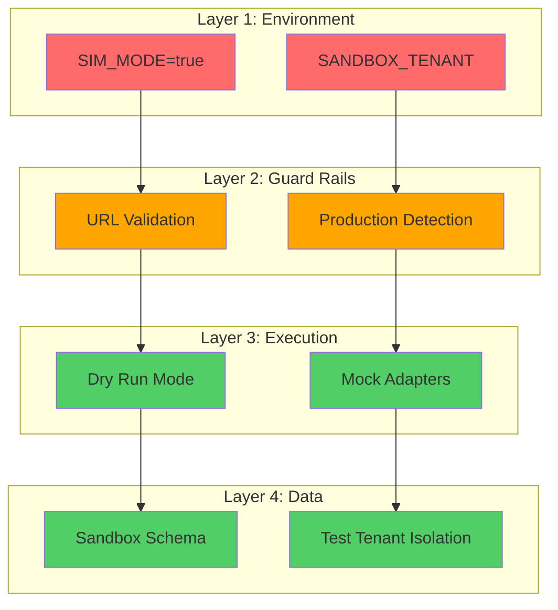

---

## 📈 Scalability Architecture

### Horizontal Scaling

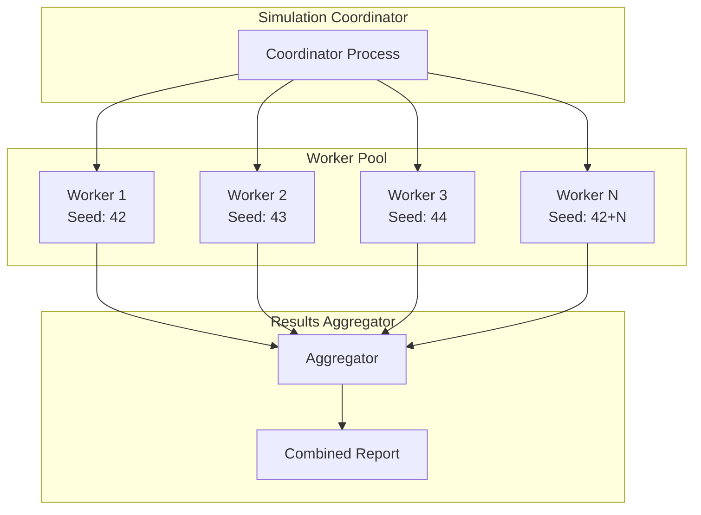

### Burst Mode Architecture

- **Rate Limiting**: Token bucket per worker
- **Load Distribution**: Round-robin to workers
- **Metrics Aggregation**: Merge histograms
- **Failure Isolation**: Worker failures don't stop test

---

## 🎯 Determinism Guarantees

### Same Seed → Same Results

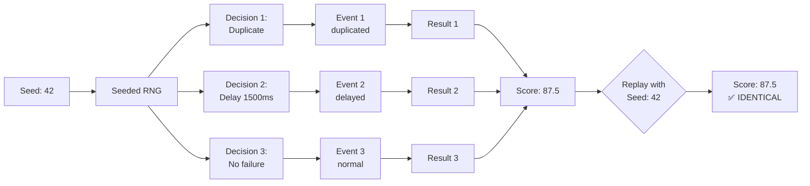

---

## 📦 Evidence Bundle Structure

```
evidence/
└── <runId>/
    ├── scorecard.json          # Final results
    ├── events.jsonl            # All events (newline-delimited JSON)
    ├── receipts.jsonl          # Idempotency receipts
    ├── metrics.json            # Latency histograms + stats
    ├── circuits.json           # Circuit breaker state history
    ├── chaos-decisions.jsonl   # Chaos decisions per event
    ├── logs.txt                # Execution logs
    └── manifest.json           # Bundle metadata
```

---

## 🔄 Retry & Recovery Architecture

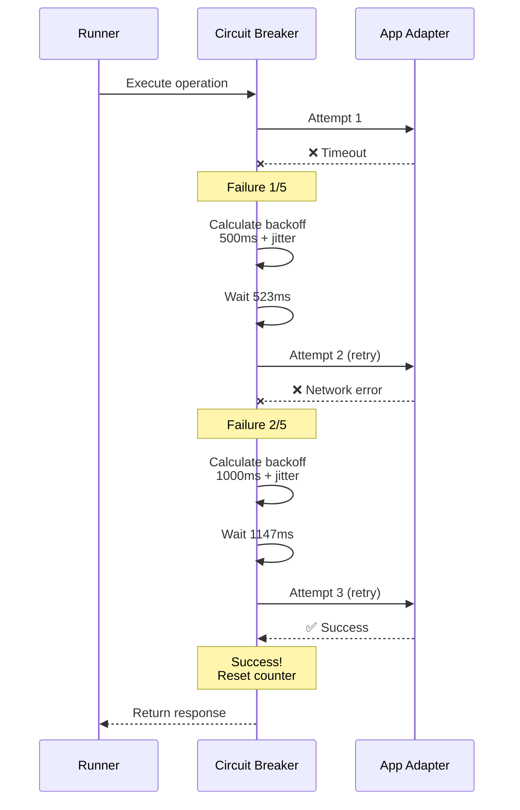

---

## 🎓 Key Design Decisions

### 1. In-Memory vs Database

**Decision:** In-memory for simulation, with DB stub for production

**Rationale:**
- Fast execution in tests
- No external dependencies for CI
- Easy to reset between runs
- Future-ready (DB persistence stubbed)

### 2. Deterministic Chaos

**Decision:** Seeded RNG for reproducibility

**Rationale:**
- Debugging failures requires replay
- Regression tests need consistency
- Audit trails need determinism

### 3. Circuit Breakers Per App

**Decision:** One circuit breaker per target app

**Rationale:**
- Isolate failures to specific services
- Prevent cascading outages
- Independent recovery

### 4. Idempotency Keys Include Timestamp

**Decision:** `tenant-eventType-timestamp-nonce`

**Rationale:**
- Globally unique across runs
- Time-based expiration
- Collision-resistant

---

## 🚀 Performance Characteristics

| Metric | Target | Typical | Notes |
|--------|--------|---------|-------|
| Beat Execution | <100ms | 50-150ms | Without chaos |
| Full Simulation (13 beats) | <60s | 30-45s | With chaos |
| Dry Run Mode | <10s | 5-8s | No real API calls |
| Burst Mode (50 req/s) | Sustained | 45-55 req/s | With chaos |
| Memory Usage | <500MB | 200-300MB | In-memory stores |
| Evidence Bundle | <10MB | 2-5MB | Per run |

---

## 🔮 Future Enhancements

1. **Database Persistence**
   - Store idempotency receipts in Supabase
   - Survive process restarts
   - Cross-instance deduplication

2. **Distributed Tracing**
   - OpenTelemetry integration
   - Span propagation across apps
   - Jaeger/Zipkin export

3. **Real-Time Dashboard**
   - WebSocket live updates
   - Circuit breaker visualization
   - Latency heatmaps

4. **Machine Learning**
   - Anomaly detection
   - Failure prediction
   - Adaptive chaos rates

---

## 📚 References

- CloudEvents Specification: https://cloudevents.io/
- Circuit Breaker Pattern: https://martinfowler.com/bliki/CircuitBreaker.html
- Idempotency Patterns: https://stripe.com/docs/api/idempotent_requests
- Chaos Engineering: https://principlesofchaos.org/

---

**Architecture Status:** ✅ **COMPLETE**
**Last Review:** 2026-01-03
**Next Review:** 2026-02-01
